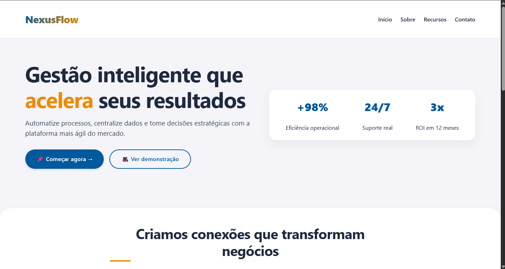
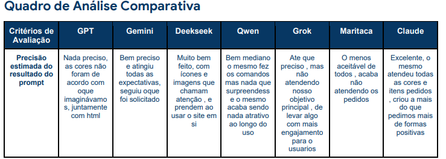

# ⚔️ Batalha de Modelos: Engenharia de Prompt com XML

## 📝 Descrição do Projeto
Este projeto consiste em uma análise crítica e comparativa do desempenho de diferentes Large Language Models (LLMs) quando submetidos a instruções estritas. O objetivo principal é avaliar a fidelidade técnica e a conformidade dessas ferramentas na interpretação de um Prompt Estruturado em XML para a geração de uma página web Single Page (HTML/CSS integrado).

Desenvolvido com foco no aprimoramento da metacognição e das habilidades em Engenharia de Prompt, o estudo isola a estética do código gerado para focar na aderência estrutural. O processamento dos dados documenta como cada arquitetura de IA lida com o respeito a tags, atributos específicos (como cores) e estruturação semântica, mapeando as nuances, pontos fortes e limitações de cada modelo para tarefas de desenvolvimento Front-end.

*Figura 1: Comparativo visual das interfaces geradas pelas diferentes IAs a partir do mesmo prompt, na imagem abaixo foi adicionado o site que GEMINI fez.*

*Figura 2: Comparativo visual das interfaces geradas pelas diferentes IAs a partir do mesmo prompt, na imagem abaixo foi adicionado o site que CHATGPT fez.*

*Figura 3: Comparativo visual das interfaces geradas pelas diferentes IAs a partir do mesmo prompt, na imagem abaixo foi adicionado o site que DeepSeek fez.*

*Figura 4: Comparativo visual das interfaces geradas pelas diferentes IAs a partir do mesmo prompt, na imagem abaixo foi adicionado o site que Grok IA fez.*

## 🚀 Tecnologias Utilizadas
* **Linguagens e Estruturas:** XML, HTML5, CSS3
* **Modelos de IA Analisados:** ChatGPT, Gemini, Claude, Qwen, DeepSeek, Grok, Maritaca
* **Ferramentas:** Ambientes web/mobile das respectivas IAs para submissão dos prompts.

## 📊 Resultados e Aprendizados
O experimento de submissão padronizada alcançou resultados sólidos para a compreensão do comportamento das LLMs em ambiente de teste técnico.
* **Compreensão de Estrutura:** Identificação do modelo que demonstrou maior precisão e obediência à hierarquia e sintaxe do XML fornecido.
* **Mapeamento de Verbosidade:** Análise da diferença no consumo de tokens e na prolixidade entre as IAs para a geração do exato mesmo escopo de resultado.
* **Tomada de Decisão Tecnológica:** Formulação de um critério prático para a seleção de ferramentas, definindo qual modelo é o mais eficiente para prototipagem rápida e qual apresenta a robustez necessária para a estruturação de códigos mais complexos.

* 
*Figura 5: Quadro de análise comparativa de performance e aderência às tags.*
*OPTEI POR COLOCAR APENAS AS IMAGENS QUE A IA FEZ QUE ATENDERAM O QUE FOI REQUISITADO PARA NAO DEIXAR O MEU READ.ME POLUIDO -> .*

4. 
*Figura 6: Representação da estrutura do prompt XML utilizado nos testes.*

---
[Voltar ao início](https://github.com/gustavoluan-dot/portfolio_gustavo_luan)
